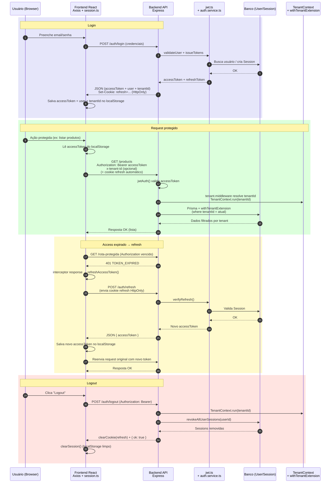
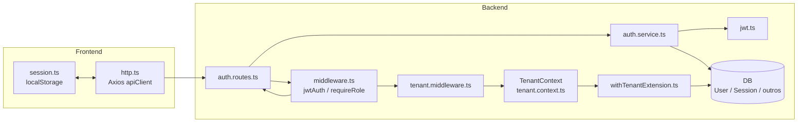

# Axis – Fluxo de Autenticação (Tokens, Cookies, Headers e Tenants)

Este documento explica, de forma didática, como funciona o fluxo de autenticação do Axis usando **access token**, **refresh token**, **cookies** e **headers**, tanto no backend quanto no frontend, incluindo dois diagramas em Mermaid para visualização.

---

## 1. Visão Geral da Arquitetura de Autenticação

No Axis, a autenticação está estruturada em três pilares principais:

1. **Access Token (JWT de curta duração)**
   - É um JWT assinado com o segredo `JWT_ACCESS_SECRET`.
   - Vai no header HTTP: `Authorization: Bearer <accessToken>`.
   - É usado em **todas as requisições protegidas**.
   - No frontend, é armazenado no **localStorage**.

2. **Refresh Token (JWT de longa duração)**
   - É um JWT assinado com o segredo `JWT_REFRESH_SECRET`.
   - É enviado e armazenado em um **cookie HttpOnly**, configurado pelo backend na rota de login.
   - O **JavaScript do frontend não tem acesso** direto ao refresh token.
   - É usado apenas na rota `/auth/refresh` para obter um novo access token quando o antigo expira.

3. **Tenant**
   - Cada request precisa estar associado a um **tenant**.
   - O `tenantId` é resolvido a partir de:
     - Claims do usuário no JWT (`tid` ou `tenantId`);
     - Header `x-tenant-id`;
     - Parâmetros de rota (por exemplo, `/tenants/:tenantId/...`).
   - O tenant é propagado pelo `TenantContext` e usado pela extensão do Prisma (`withTenantExtension`) para garantir o isolamento multi-tenant (filtro automático por `tenantId`).

---

## 2. Diagrama de Sequência – Fluxo de Autenticação

Cole este bloco em um arquivo Markdown (por exemplo, `docs/auth-flow.md`) com suporte a Mermaid:



---

## 3. Diagrama de Arquitetura – Arquivos e Componentes

Este diagrama mostra como os arquivos se relacionam no fluxo de autenticação:



---

## 4. Fluxo Completo: Login → Requests Protegidas → Refresh → Logout (Descrição)

### 4.1. Login

1. O frontend envia:
   ```http
   POST /auth/login
   Content-Type: application/json

   {
     "email": "user@axis.com",
     "password": "senha123"
   }
   ```

2. No backend, a rota está definida em **`auth.routes.ts`** (ex.: `authRouter.post("/login", ...)`).  
   Esse handler faz, de forma resumida:

   - Valida o corpo da requisição (Zod/validator).
   - Usa `validateUser(email, password)` (de `auth.service.ts`) para:
     - Buscar o usuário via Prisma;
     - Verificar a senha com `argon2.verify`;
     - Checar se o usuário está ativo.

   - Se estiver tudo certo, chama `issueTokens(user)` (também em `auth.service.ts`), que:
     - Gera o **access token** (`signAccess` em `jwt.ts`);
     - Gera o **refresh token** (`signRefresh` em `jwt.ts`);
     - Cria um registro de **Session** no banco (tabela `Session`) amarrando o refresh token ao usuário/tenant.

   - Define um **cookie HttpOnly** com o refresh token:
     ```ts
     res.cookie(REFRESH_COOKIE_NAME, refreshToken, refreshCookieOptions);
     ```
     Onde `refreshCookieOptions` inclui opções como `httpOnly`, `sameSite`, `secure`, `path`, etc.

   - Retorna no corpo da resposta:
     - O **access token**;
     - Os dados públicos do usuário;
     - Informações de tenant/role que o frontend precisa.

3. No frontend, o módulo **`session.ts`**:
   - Salva o **access token** no `localStorage` (ex.: `setAccessToken` / `setTokens`);
   - Salva o usuário atual (`AxisCurrentUser`) em `localStorage` (`USER_KEY`);
   - Salva o `tenantId` em `TENANT_KEY`.
   - O **refresh token não é salvo no JS**: ele já está seguro no cookie HttpOnly configurado pelo backend.

---

### 4.2. Requests Protegidas com Access Token

Sempre que o React chama a API usando o `apiClient` (Axios):

```ts
apiClient.get("/alguma-rota-protegida");
```

O fluxo é:

1. O cliente HTTP está configurado em **`http.ts`**:
   ```ts
   export const apiClient = axios.create({
     baseURL: API_URL,
     withCredentials: true,
   });
   ```
   - `baseURL` vem de `config.ts` (usando `VITE_API_URL` ou fallback);
   - `withCredentials: true` faz o navegador enviar o **cookie de refresh** junto, automaticamente.

2. Request interceptor (em `http.ts`):
   ```ts
   apiClient.interceptors.request.use((config) => {
     const token = getAccessToken(); // vem de session.ts (localStorage)

     if (token) {
       const headers = (config.headers ?? {}) as Record<string, unknown>;
       headers.Authorization = `Bearer ${token}`;
       config.headers = headers;
     }

     return config;
   });
   ```

   - Pega o **access token** do `localStorage` via `getAccessToken()` (`session.ts`);
   - Injeta o header `Authorization: Bearer <token>` na requisição;
   - Como `withCredentials` é `true`, o browser também manda o **cookie com refresh token**.

3. No backend, a requisição protegida passa pelo middleware **`jwtAuth`** (em `middleware.ts`):

   - Lê o header `Authorization`;
   - Valida o formato `Bearer <token>`;
   - Usa `verifyAccess(token)` de `jwt.ts` para:
     - Validar assinatura com `JWT_ACCESS_SECRET`;
     - Checar expiração;
     - Ler claims: `sub`, `tenantId/tid`, `role`, `type`, etc.

   - Se for válido:
     - Monta `req.user` com algo como:
       ```ts
       req.user = {
         userId: payload.sub,
         tenantId: payload.tid || payload.tenantId,
         role: payload.role, // "ADMIN" | "OWNER" | "ATTENDANT"
         type: payload.type, // "access"
       };
       ```

   - Se for inválido ou expirado:
     - Responde com `401` usando `respondWithError` e códigos como `TOKEN_INVALID` ou `TOKEN_EXPIRED` (de `ErrorCodes`).

4. Em seguida, entra o middleware de tenant **`tenant.middleware.ts`**:

   ```ts
   const tenantFromUser = (req.user && (req.user.tid || req.user.tenantId)) as string | undefined;
   const tenantFromHeader = req.headers["x-tenant-id"] as string | undefined;
   const tenantFromParams = req.params?.tenantId as string | undefined;

   const tenantId = tenantFromUser || tenantFromHeader || tenantFromParams;
   ```

   - Tenta resolver o `tenantId` na seguinte ordem:
     1. Claims do usuário (`req.user.tid` / `req.user.tenantId`);
     2. Header `x-tenant-id` enviado pelo frontend (quando aplicável);
     3. Parâmetros da URL (`req.params.tenantId`).

   - Se **não encontrar**, lança um `HttpError` com `TENANT_NOT_RESOLVED`;
   - Se **encontrar**:
     - Define `req.tenantId = tenantId`;
     - Chama `enterTenantScope(tenantId, next)`, que usa `TenantContext.run(tenantId, cb)` para amarrar o tenant ao contexto assíncrono da requisição.

5. O `TenantContext` é definido em **`tenant.context.ts`**:
   - Usa `AsyncLocalStorage<string>` para guardar o `tenantId` por request;
   - Permite chamar `TenantContext.get()` em qualquer lugar (services, Prisma, etc) para saber o tenant atual.

6. A extensão do Prisma em **`withTenantExtension.ts`** consome esse contexto:

   - Mantém uma lista de modelos multi-tenant (`DIRECT_TENANT_MODELS`), como `User`, `Session`, `Product`, etc.
   - Para esses modelos, a extensão:
     - Injeta `where: { tenantId: <tenantAtual> }` automaticamente nas queries (`findMany`, `updateMany`, etc);
     - Garante que `data.tenantId = <tenantAtual>` seja preenchido em `create`.

   Resultado: **toda operação de banco é automaticamente filtrada pelo tenant correto**, sem precisar repetir `tenantId` em toda query manualmente.

---

### 4.3. Refresh de Token (Access Expirado)

Quando o **access token expira**, mas o refresh token ainda é válido:

1. Em uma rota protegida, o `jwtAuth` detecta que o token expirou e responde com `401` e código, por exemplo, `TOKEN_EXPIRED`.

2. No frontend, o **response interceptor** do Axios em `http.ts` entra em ação:

   ```ts
   apiClient.interceptors.response.use(
     (response) => response,
     async (error: AxiosError) => {
       const originalRequest = error.config as any;

       if (
         error.response?.status === 401 &&
         !originalRequest._retry
         // (opcional) checar se o código de erro é TOKEN_EXPIRED
       ) {
         originalRequest._retry = true;

         const newToken = await refreshAccessToken();
         if (!newToken) {
           clearSession();
           return Promise.reject(error);
         }

         return apiClient(originalRequest);
       }

       return Promise.reject(error);
     }
   );
   ```

   - Se a resposta foi 401 e a requisição ainda não foi re-tentada:
     - Chama `refreshAccessToken()`;
     - Se o refresh der certo:
       - Salva o novo access token via `setAccessToken` (`session.ts`);
       - Re-executa a requisição original (`apiClient(originalRequest)`);
     - Se falhar:
       - Chama `clearSession()` e o usuário é efetivamente deslogado.

3. A função `refreshAccessToken()` faz algo como:

   ```ts
   async function refreshAccessToken() {
     const res = await apiClient.post("/auth/refresh");
     const newToken = res.data.accessToken;
     setAccessToken(newToken);
     return newToken;
   }
   ```

4. No backend, a rota `/auth/refresh` (em `auth.routes.ts`):

   - Lê o **cookie HttpOnly** de refresh token:
     ```ts
     const token = req.cookies[REFRESH_COOKIE_NAME];
     ```
   - Usa `verifyRefresh(token)` (`jwt.ts`) para validar:
     - Assinatura com `JWT_REFRESH_SECRET`;
     - Expiração;
     - Tipo de token (`type: "refresh"`);
   - Confere na tabela `Session` se o refresh token (ou sua sessão) ainda é válido;
   - Se tudo ok:
     - Gera um **novo access token** com `signAccess`;
     - Opcionalmente pode rotacionar o refresh token;
     - Retorna o novo access token no JSON;
     - (Se rotacionar o refresh, atualiza também o cookie).

---

### 4.4. Logout

No backend, a rota `/auth/logout` (em `auth.routes.ts`):

- Requer autenticação via `jwtAuth` (para saber qual usuário está saindo);
- Usa `TenantContext.run(req.user.tenantId, () => revokeAllUserSessions(req.user!.userId))` para:
  - Remover todas as sessões (`Session`) do usuário naquele tenant (invalidando os refresh tokens);
- Limpa o cookie de refresh:
  ```ts
  res.clearCookie(REFRESH_COOKIE_NAME, {
    ...refreshCookieOptions,
    maxAge: undefined,
  });
  ```
- Retorna `{ ok: true }`.

No frontend, é recomendado chamar também `clearSession()` (`session.ts`) para limpar:

- Access token do `localStorage`;
- Usuário atual;
- TenantId;
- Timestamp de login.

---

## 5. Papéis dos Arquivos Envolvidos

### Backend

#### `jwt.ts`
- Define o payload dos JWTs (`JWTPayload`).
- Implementa:
  - `signAccess(payload)` → cria access token com `JWT_ACCESS_SECRET`;
  - `signRefresh(payload)` → cria refresh token com `JWT_REFRESH_SECRET`;
  - `verifyAccess(token)` → valida o access token;
  - `verifyRefresh(token)` → valida o refresh token.

#### `auth.service.ts`
- `validateUser(email, password)` → autentica usuário (Prisma + argon2);
- `issueTokens(user)` → gera access/refresh + cria `Session` no banco;
- `revokeAllUserSessions(userId)` → deleta sessões (refresh tokens) de um usuário;
- Funções relacionadas a reset de senha:
  - `createPasswordResetTokenForUser`;
  - `resetUserPasswordFromToken`.

#### `auth.routes.ts`
- Define as rotas de autenticação:
  - `POST /auth/login` → login, emissão de tokens, cookie de refresh;
  - `GET /auth/me` → retorna dados do usuário autenticado;
  - `POST /auth/refresh` → gera novo access token a partir do refresh;
  - `POST /auth/logout` → invalida sessões e limpa cookie;
  - `POST /auth/forgot-password` / `POST /auth/reset-password` → fluxo de recuperação de senha.

#### `middleware.ts`
- `jwtAuth(...)` → middleware de autenticação:
  - Lê o header `Authorization`;
  - Valida o access token (`verifyAccess`);
  - Preenche `req.user`;
  - Em caso de erro, responde com `401` e error codes adequados.
- `requireRole(...roles)` → middleware de autorização (RBAC):
  - Permite apenas usuários com determinada role ("ADMIN", "OWNER", "ATTENDANT").

#### `tenant.middleware.ts`
- Resolve o `tenantId` em cada requisição:
  - A partir de `req.user` (claims do token);
  - Ou `x-tenant-id`;
  - Ou parâmetros da URL.
- Lança erro se não conseguir resolver.
- Se resolver, seta `req.tenantId` e chama `enterTenantScope(tenantId, next)`.

#### `tenant.context.ts`
- Implementa `TenantContext` usando `AsyncLocalStorage<string>`.
- Permite:
  - `TenantContext.run(tenantId, cb)` → roda código dentro do contexto de um tenant;
  - `TenantContext.get()` → obter o tenantId atual em qualquer camada.

#### `withTenantExtension.ts`
- Extensão do Prisma responsável por aplicar automaticamente o filtro de tenant:
  - Em operações de leitura e escrita;
  - Para modelos multi-tenant específicos.
- Garante que cada query seja automaticamente limitada ao `tenantId` atual.

---

### Frontend

#### `config.ts`
- Lê a URL base da API (por ex.: `VITE_API_URL`) e normaliza:
  ```ts
  export const API_URL = apiBase.replace(/\/$/, "");
  ```

#### `session.ts`
- Gerencia **estado de autenticação** no `localStorage`:
  - Tokens (`axis.auth.tokens`);
  - Usuário atual (`axis.auth.user`);
  - Tenant atual (`axis.auth.tenantId`);
  - Timestamp de login (`axis.auth.timestamp`).
- Funções principais (nomes aproximados):
  - `setTokens(tokens)` / `setAccessToken(token)` / `getAccessToken()`;
  - `setCurrentUser(user)` / `getCurrentUser()`;
  - `setTenantId(id)` / `getTenantId()`;
  - `clearSession()` → apaga tudo;
  - `hasAdminAccess(user)` → checa `role` (ADMIN/OWNER);
  - `getAuthHeaders()` → monta headers com Authorization + `x-tenant-id` (quando preciso).

#### `http.ts`
- Cria o cliente Axios:
  ```ts
  export const apiClient = axios.create({
    baseURL: API_URL,
    withCredentials: true,
  });
  ```
- **Request interceptor**:
  - Lê o access token via `getAccessToken()`;
  - Injeta `Authorization: Bearer <token>` em todas as requisições.
- **Response interceptor**:
  - Se receber `401` (por exemplo, token expirado), tenta:
    - Chamar `refreshAccessToken()` (POST `/auth/refresh`);
    - Atualizar o access token em `localStorage` (`setAccessToken`);
    - Repetir a requisição original;
    - Em caso de falha no refresh, chama `clearSession()` e não repete a requisição.

---

## 6. Resumo Final

- **Access token**
  - Curta duração;
  - Vai no header `Authorization: Bearer <token>`;
  - Armazenado no `localStorage` (frontend);
  - Validado pelo middleware `jwtAuth` (backend).

- **Refresh token**
  - Longa duração;
  - Guardado em cookie HttpOnly;
  - JS não tem acesso direto;
  - Usado somente para `/auth/refresh`.

- **Tenant**
  - Identificado pelo JWT (claims), header `x-tenant-id` ou params;
  - Resolvido por `tenant.middleware.ts` e guardado no `TenantContext`;
  - Prisma aplica automaticamente o filtro de `tenantId` via `withTenantExtension.ts`.

- **Frontend**
  - `session.ts` cuida de **salvar/ler tokens e usuário**;
  - `http.ts` cuida de **enviar token no header** e **fazer refresh automático**.

- **Backend**
  - `jwt.ts` cria/valida tokens;
  - `auth.service.ts` cuida da lógica de login, sessões, reset de senha;
  - `auth.routes.ts` expõe as rotas HTTP de autenticação;
  - `middleware.ts` faz autenticação/autorização;
  - `tenant.*` + `withTenantExtension.ts` garantem isolamento multi-tenant.
